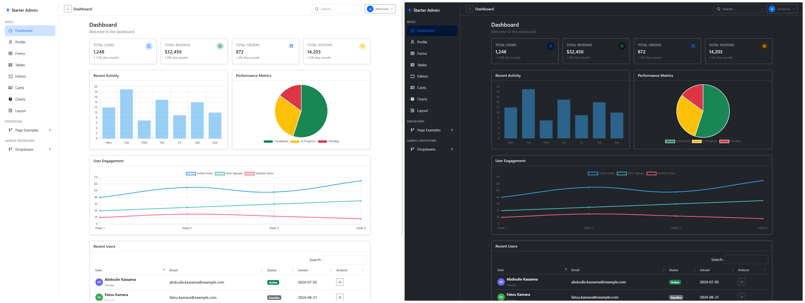

# Free Bootstrap 5 Admin Template


A lightweight Bootstrap 5 admin dashboard template inspired by Laravel's starter kit UI. Includes a responsive layout, sidebar, top navbar, cards, charts, tables and built-in light/dark theme support.

## Features

- **Responsive layout:** Works across desktop, tablet and mobile with Bootstrap 5 grid.
- **Light & dark mode:** Built-in theme support using data attributes and CSS variables.
- **Common admin pages:** Dashboard, Tables, Forms, Charts, Cards, Editors, Profile, Auth pages.
- **Vanilla PHP includes:** Simple PHP include-based structure for easy integration into PHP apps.
- **Frontend assets:** Pre-bundled CSS and JS in `assets/` for quick prototyping.

## Quick Start

1. Place the project in your local web server document root (e.g., AMPPS, XAMPP, MAMP) or use PHP's built-in server.

   - Using AMPPS/XAMPP: copy the project folder to your server's `www` / `htdocs` directory and open `http://localhost/your-folder/`.
   - Using PHP built-in server (from project root):

     ```powershell
     php -S localhost:8000
     # then open http://localhost:8000 in your browser
     ```

2. Open `index.php` in the browser to view the dashboard.

## File Structure (key files)

- `index.php` — Main dashboard page.
- `includes/` — PHP include files for header assets, sidebar, navbar and footer.
  - `includes/_header_assets.php` — CSS, meta and head assets.
  - `includes/_sidebar.php` — Sidebar markup and menu.
  - `includes/_top_navbar.php` — Top navigation bar.
  - `includes/_footer_assets.php` — Footer script includes.
- `assets/` — Static assets (CSS, JS, images).
  - `assets/css/site.css` and `assets/css/auth.css` — primary styles.
  - `assets/js/site.js` and `assets/js/charts.js` — small JS helpers and charts.

## Light / Dark Mode

The template supports a light and dark theme via the `data-bs-theme` attribute on the `<html>` element. Toggle the attribute between `light` and `dark` to switch themes. The theme value is used with CSS variables to adjust colors across the UI.

Example:

```html
<html lang="en" data-bs-theme="light">
  <!-- or data-bs-theme="dark" -->
</html>
```

You can wire theme toggles to user preferences in `assets/js/site.js` or add persistence (localStorage) to remember the user's choice.

## Customization

- Colors & spacing: Edit `assets/css/site.css` to update variables and utilities.
- Navigation: Update `includes/_sidebar.php` to change menu items or structure.
- Pages: Copy `index.php` and use the layout and includes to create new pages.
- Charts: `assets/js/charts.js` contains example chart initialization — replace sample data with your own.

## Integrating with Laravel (or other frameworks)

This is a frontend UI template delivered as plain PHP files for quick prototyping. To integrate into Laravel:

- Convert the layout into Blade components or a single `layouts/app.blade.php` and move assets into `public/`.
- Replace the PHP `include` calls with Blade `@include` or `@component` directives.
- Move data-driven parts (tables, charts) to controllers and pass data into views.

## Development Notes

- No build step is required — CSS and JS are included as plain files. If you add tooling (webpack, Vite) you can modernize asset bundling.
- The template uses a few icon fonts/classes (e.g., Remix Icon). Ensure those assets are available or replace with your chosen icon set.

## Contributing

Contributions, suggestions and fixes are welcome. Open an issue or submit a pull request with improvements.

## License

Mazer is under [MIT License](./LICENSE).
